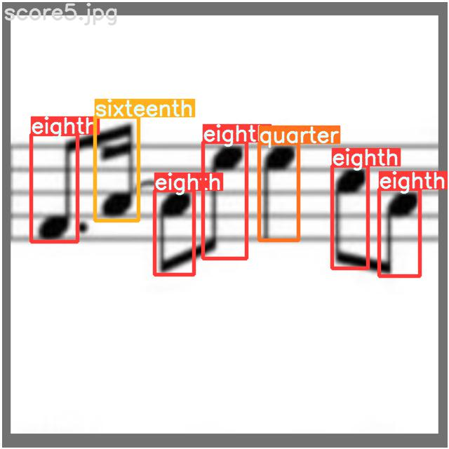
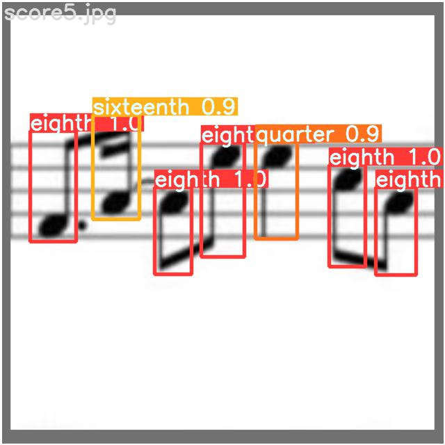
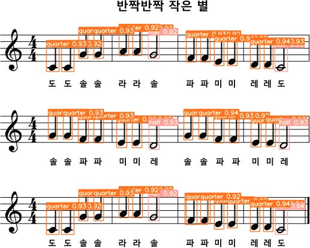
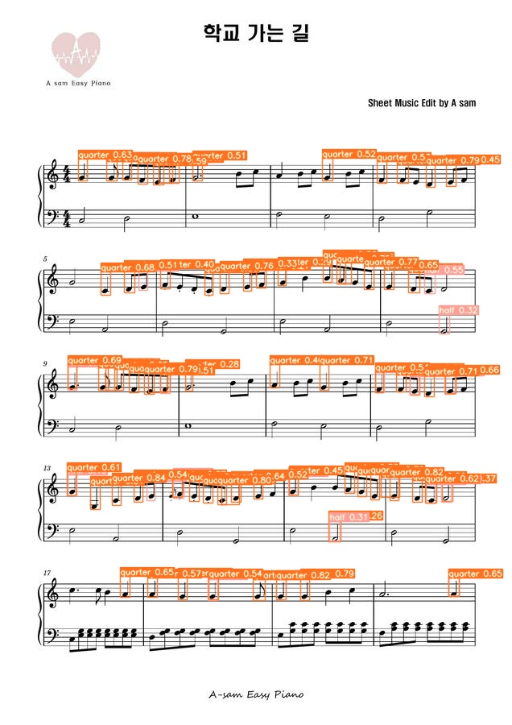

# MachineMusician

#### 악보 인식 프로그램 개발과정 기록

## 21. 07. 28
* 가장 중요한 2가지 Task를 선정
    1. 박자 인식 (음표의 모양)
    2. 음정 인식 (음표의 높낮이)

* 먼저 음표의 모양을 Detection으로 검출한 뒤, 바운딩 박스의 좌표가 정확하게 계산된다면 그대로 음정에 적용. 좌표값이 불안정하면 openCV 모폴로지 연산을 사용하여 음정을 계산 및 보정할 계획

* 임시표, 이음줄 등의 추가 요소들은 위 작업을 완성하고 보완할 예정

  

## 21. 08 .07
* Detection 알고리즘에 [EfficientDet](https://github.com/xuannianz/EfficientDet)을 사용하고자 오픈소스를 실행하였으나 metric score가 NaN으로 출력되며 학습이 진행되지 않음
* Gradient Exploding을 의심하여 lr을 0에 가깝게 줄이고, BN 레이어를 추가하는 등의 시도를 하였으나 결과 변동 없음

## 21. 08 .09

* EfficientDet 대신 [Yolo v5](https://github.com/ultralytics/yolov5)를 사용하기로 결정

* Yolo v5도 EfficientDet 못지 않게 강력하며, API와 도큐먼트가 고수준으로 구성되어 사용이 간편하기 때문에 이전 프로젝트에서 사용했던 경험이 있음

  (사실 최신 모델들은 FPN나 MixUp 등의 trick이 무수하게 적용되어 나와서 Problem에 비해 Overpower 이기 때문에 뭘 사용하든 상관없다는 생각)

* 음표 이미지 데이터셋으로 학습한 결과 오선 위의 음표를 인식하지 못하였음

  

  

* 오선이 있는 악보를 직접 라벨링하여 데이터셋을 구성함. 라벨링은 [makesense.ai](https://www.makesense.ai/)를 사용

  

* #### 추론 결과

  1. 학습 데이터에 대한 추론 결과

     

     

  2. 테스트 데이터에 대한 추론 결과

* 추론 결과, 간단한 악보에는 높은 인식률을 보임
* 두번째 예제에서는 인식이 되지 않은 음표가 보이며, 특히 꼬리가 아래를 향하는 음표들이 인식되지 않았음. default Augmentation setting에서 Rotation과 Verttical flip이 적용되지 않았음을 확인하였고, 적용되도록 설정
* 온쉼표와 2분쉼표가 구분되지 않게 되는 문제가 있지만 알고리즘으로 해결할 수 있는 사소한 문제라고 판단함 (마디 박자를 계산하면 어떤 쉼표인지 알 수 있음)

